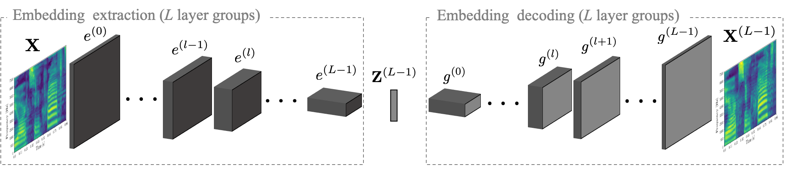

## Introduction

The complete understanding of the decision-making process  of  Convolutional  Neural  Networks  (CNNs)  is  far  fro being fully reached. Many researchers proposed techniques to interpret what a network actually “learns” from data. Nevertheless. many  questions  still  remain  unanswered.  In  this  work  we  study one  aspect  of  this  problem  by  reconstructing  speech  from  the intermediate  embeddings  computed  by  a  CNNs.  Specifically,  w econsider  a  pre-trained  network  that  acts  as  a  feature  extractor from  speech  audio.  We  investigate  the  possibility  of  inverting these  features,  reconstructing  the  input  signals  in  a  black-box scenario,  and  quantitatively  measure  the  reconstruction  quality by measuring the word-error-rate of an off-the-shelf ASR model. Experiments  performed  using  two  different  CNN  architectures trained for six different classification tasks, show that it is possible to   reconstruct   time-domain   speech  signals  that  preserve  the semantic content, whenever the embeddings are extracted beforethe  fully  connected  layers.

### Method

<audio controls>
<source src="audio/LJ049-0209.wav" type="audio/mpeg">
Your browser does not support the audio element.
</audio>

### Results

  <a href="/speech_reconstruction_embeddings/vggish_results.html" class="btn">VGGish</a> 
  <a href="/speech_reconstruction_embeddings/smallenc_results.html" class="btn">SmallEnc</a> 

<a href="/speech_reconstruction_embeddings/vggish_results.html" class="btn">VGGish</a>

### Support or Contact
For any information regarding the paper or the code send us an email at <luca.comanducci@polimi.it>!
