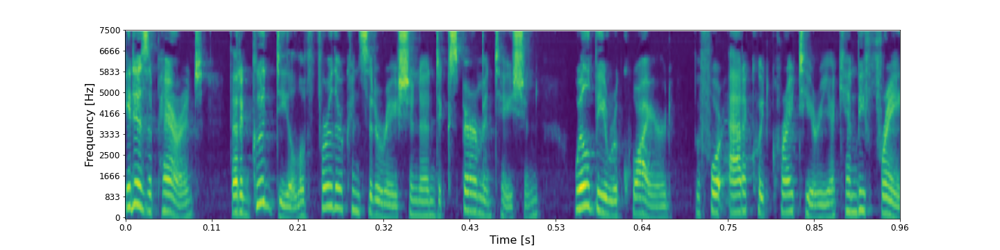
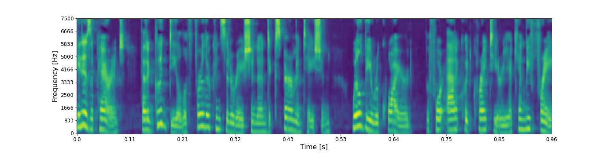
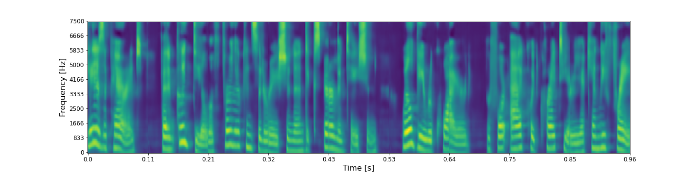
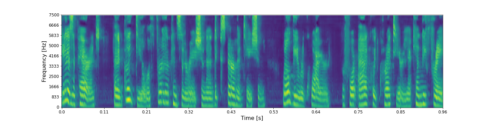
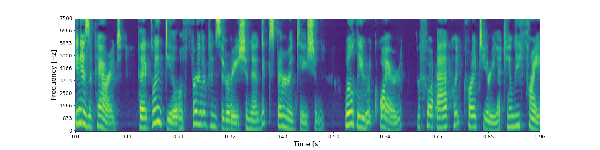
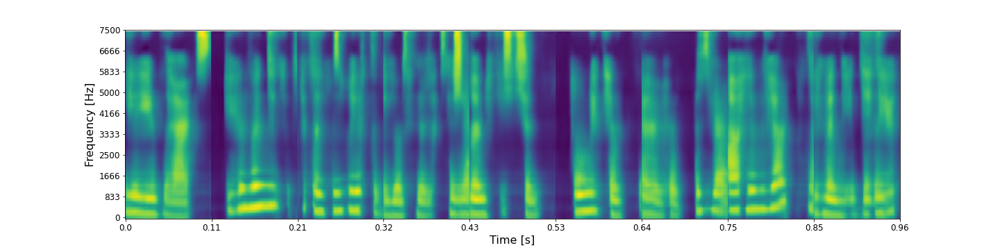
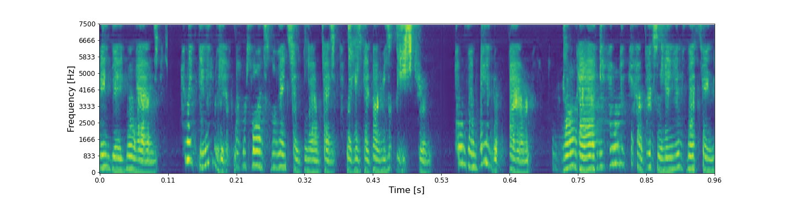

## Ground-truth

<audio controls>
<source src="audio/tut-urban-acoustic-scenes-2018/LJ050-0099_ground_truth.wav" type="audio/mpeg">
Your browser does not support the audio element.
</audio>

**ASR**: It is apparent that a good deal of further consideration and experimentation will be required before packwood criteria can be free

## Layer 0 - shape (48 X 32 X 8)

* ### RecCNN

<audio controls>
<source src="audio/tut-urban-acoustic-scenes-2018/LJ050-0099_layer_0_reccnn.wav" type="audio/mpeg">
Your browser does not support the audio element.
</audio>

**ASR**:  It is apparent that a good deal of further consideration and experimentation will be required before i could criteria can be free

* ### RecGAN

<audio controls>
<source src="audio/tut-urban-acoustic-scenes-2018/LJ050-0099_layer_0_recgan.wav" type="audio/mpeg">
Your browser does not support the audio element.
</audio>

**ASR**:  It is apparent that a good deal of further consideration and experimentation will be required before i could criteria can be free

## Layer 1 - shape (24 X 16 X 16)

* ### RecCNN

<audio controls>
<source src="audio/tut-urban-acoustic-scenes-2018/LJ050-0099_layer_1_reccnn.wav" type="audio/mpeg">
Your browser does not support the audio element.
</audio>

**ASR**:  Is that parents a good deal of further consideration and experimentation will be required before packwood criteria can be free

* ### RecGAN

<audio controls>
<source src="audio/tut-urban-acoustic-scenes-2018/LJ050-0099_layer_1_recgan.wav" type="audio/mpeg">
Your browser does not support the audio element.
</audio>

**ASR**:  As a parent had deal of further consideration and experimentation will be required before i could crack units in the fray

## Layer 2 - shape (12 X 8 X 32)

* ### RecCNN

<audio controls>
<source src="audio/tut-urban-acoustic-scenes-2018/LJ050-0099_layer_2_reccnn.wav" type="audio/mpeg">
Your browser does not support the audio element.
</audio>

**ASR**:  Is it parents and good deal of further consideration and experimentation will be required before packwood criteria can be fray

* ### RecGAN

<audio controls>
<source src="audio/tut-urban-acoustic-scenes-2018/LJ050-0099_layer_2_recgan.wav" type="audio/mpeg">
Your browser does not support the audio element.
</audio>

**ASR**:  Is that parents and good deals to consideration and experimentation will be required for packwood criteria can be free

## Layer 3 - shape (6 X 4 X 64)

* ### RecCNN

<audio controls>
<source src="audio/tut-urban-acoustic-scenes-2018/LJ050-0099_layer_3_reccnn.wav" type="audio/mpeg">
Your browser does not support the audio element.
</audio>

**ASR**:  Is it parents a good deal for her consideration and experimentation will be required before actually criteria to the fray

* ### RecGAN

<audio controls>
<source src="audio/tut-urban-acoustic-scenes-2018/LJ050-0099_layer_3_recgan.wav" type="audio/mpeg">
Your browser does not support the audio element.
</audio>

**ASR**: Iit is apparent that ideal it a consideration and experimentation will be required to flop acrid criteria can be free

## Layer 5 - shape (1 X 128)

* ### RecCNN

<audio controls>
<source src="audio/tut-urban-acoustic-scenes-2018/LJ050-0099_layer_6_reccnn.wav" type="audio/mpeg">
Your browser does not support the audio element.
</audio>

**ASR**:  Hey that's him and it's it's it's been thirty years the stage is set for return is that how that money to

* ### RecGAN

<audio controls>
<source src="audio/tut-urban-acoustic-scenes-2018/LJ050-0099_layer_6_recgan.wav" type="audio/mpeg">
Your browser does not support the audio element.
</audio>

**ASR**:  Get your hands drinking and universal as long as leftist and taken as jim come and get to in contact hard candies in that thing

