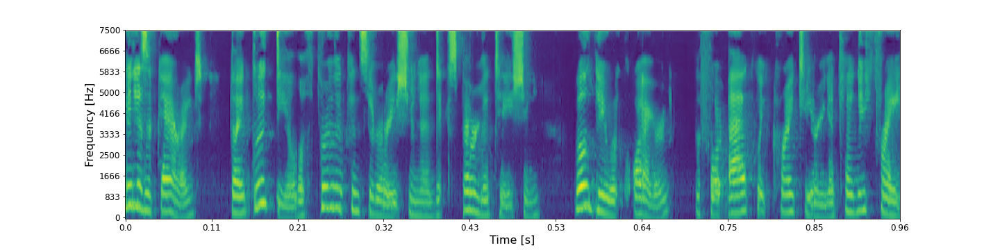
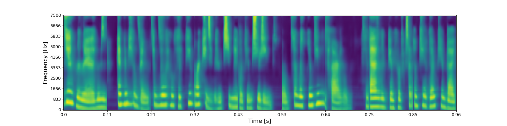

## Ground-truth

<audio controls>
<source src="audio/birdsong_detection/LJ050-0099_ground_truth.wav" type="audio/mpeg">
Your browser does not support the audio element.
</audio>

**ASR**: It is apparent that a good deal of further consideration and experimentation will be required before packwood criteria can be free

## Layer 0 - shape (48 X 32 X 8)

* ### RecCNN

<audio controls>
<source src="audio/birdsong_detection/LJ050-0099_layer_0_reccnn.wav" type="audio/mpeg">
Your browser does not support the audio element.
</audio>

**ASR**: It is apparent that a good deal of further consideration and experimentation will be required before i could criteria can be free

* ### RecGAN

<audio controls>
<source src="audio/birdsong_detection/LJ050-0099_layer_0_recgan.wav" type="audio/mpeg">
Your browser does not support the audio element.
</audio>

**ASR**: It is apparent that a good deal of further consideration and experimentation will be required before i could criteria can be free

## Layer 1 - shape (24 X 16 X 16)

* ### RecCNN

<audio controls>
<source src="audio/birdsong_detection/LJ050-0099_layer_1_reccnn.wav" type="audio/mpeg">
Your browser does not support the audio element.
</audio>

**ASR**:  Is it parents that a good deal of further consideration and experimentation will be required before packwood criteria can be free

* ### RecGAN

<audio controls>
<source src="audio/birdsong_detection/LJ050-0099_layer_1_recgan.wav" type="audio/mpeg">
Your browser does not support the audio element.
</audio>

**ASR**:  It is apparent that a good deal further consideration and experimentation will be required before i could criteria can be free

## Layer 2 - shape (12 X 8 X 32)

* ### RecCNN

<audio controls>
<source src="audio/birdsong_detection/LJ050-0099_layer_2_reccnn.wav" type="audio/mpeg">
Your browser does not support the audio element.
</audio>

**ASR**: Is it parents had a good deal further consideration and experimentation will be required before packwood criteria kenny fray

* ### RecGAN

<audio controls>
<source src="audio/birdsong_detection/LJ050-0099_layer_2_recgan.wav" type="audio/mpeg">
Your browser does not support the audio element.
</audio>

**ASR**:  Is that parents a good deal for their consideration and experimentation will be required before i could criteria can be free

## Layer 3 - shape (6 X 4 X 64)

* ### RecCNN

<audio controls>
<source src="audio/birdsong_detection/LJ050-0099_layer_3_reccnn.wav" type="audio/mpeg">
Your browser does not support the audio element.
</audio>

**ASR**:  His parents a good deal for a consideration and experimentation will be required before acted criteria kenny fray

* ### RecGAN

<audio controls>
<source src="audio/birdsong_detection/LJ050-0099_layer_3_recgan.wav" type="audio/mpeg">
Your browser does not support the audio element.
</audio>

**ASR**:  Yes if clarence but a deal further consideration and experimentation will be required before tackling right here in it for the fray

## Layer 5 - shape (1 X 128)

* ### RecCNN

<audio controls>
<source src="audio/birdsong_detection/LJ050-0099_layer_6_reccnn.wav" type="audio/mpeg">
Your browser does not support the audio element.
</audio>

**ASR**:  And hernandez and a sense of humor case in chief of the g. for hunting for food and her fucking shit

* ### RecGAN

<audio controls>
<source src="audio/birdsong_detection/LJ050-0099_layer_6_recgan.wav" type="audio/mpeg">
Your browser does not support the audio element.
</audio>

**ASR**:  I don't like the d. n. a complaint was an into dinner is you can use glaring asians are and all the hair just an icon can count on it drought

