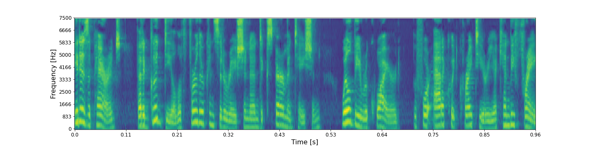
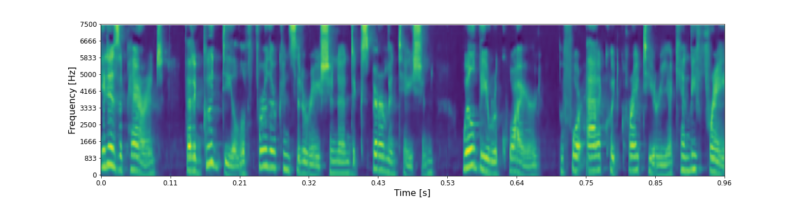
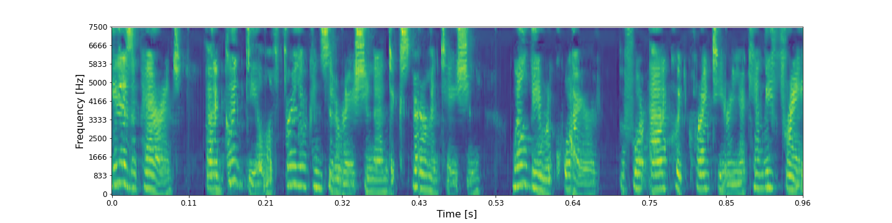
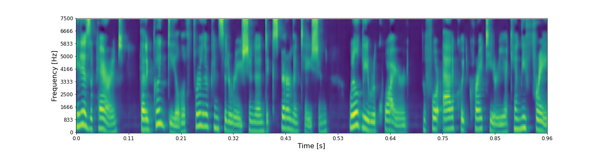
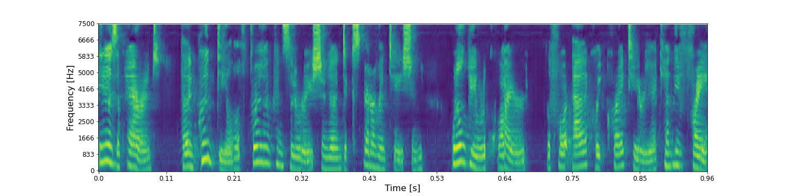
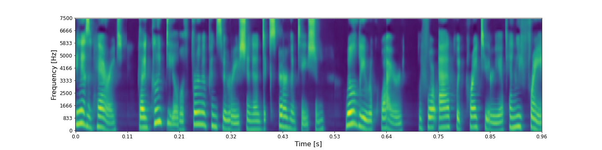
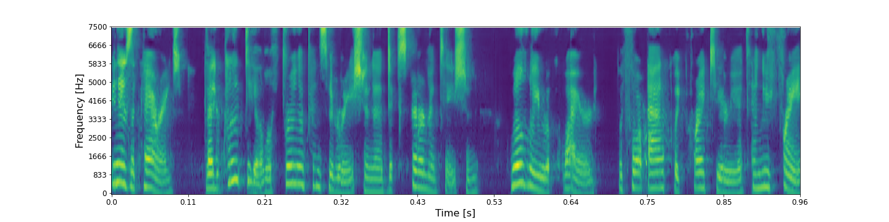
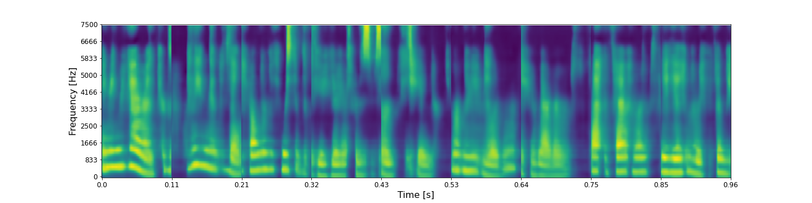
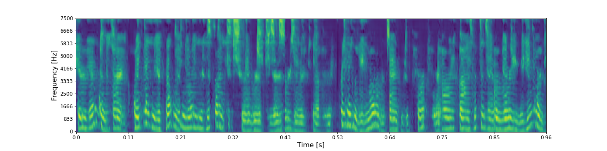

## Ground-truth

<audio controls>
<source src="audio/lang_id/LJ050-0099_ground_truth.wav" type="audio/mpeg">
Your browser does not support the audio element.
</audio>

**ASR**: It is apparent that a good deal of further consideration and experimentation will be required before packwood criteria can be free

## Layer 0 - shape (48 X 32 X 8)

* ### RecCNN

<audio controls>
<source src="audio/lang_id/LJ050-0099_layer_0_reccnn.wav" type="audio/mpeg">
Your browser does not support the audio element.
</audio>

**ASR**:  It is apparent that a good deal of further consideration and experimentation will be required before packwood criteria can be free

* ### RecGAN

<audio controls>
<source src="audio/lang_id/LJ050-0099_layer_0_recgan.wav" type="audio/mpeg">
Your browser does not support the audio element.
</audio>

**ASR**:  It is apparent that a good deal of further consideration and experimentation will be required for packwood criteria can be free

## Layer 1 - shape (24 X 16 X 16)

* ### RecCNN

<audio controls>
<source src="audio/lang_id/LJ050-0099_layer_1_reccnn.wav" type="audio/mpeg">
Your browser does not support the audio element.
</audio>

**ASR**:  It is apparent that a good deal of further consideration and experimentation will be required before packwood criteria can be free

* ### RecGAN

<audio controls>
<source src="audio/lang_id/LJ050-0099_layer_1_recgan.wav" type="audio/mpeg">
Your browser does not support the audio element.
</audio>

**ASR**:  As a parent to good deal of training consideration and experimentation will be required for concrete prettier ye can be free

## Layer 2 - shape (12 X 8 X 32)

* ### RecCNN

<audio controls>
<source src="audio/lang_id/LJ050-0099_layer_2_reccnn.wav" type="audio/mpeg">
Your browser does not support the audio element.
</audio>

**ASR**: Is it parents that a good deal of further consideration and experimentation will be required before packwood criteria can be free

* ### RecGAN

<audio controls>
<source src="audio/lang_id/LJ050-0099_layer_2_recgan.wav" type="audio/mpeg">
Your browser does not support the audio element.
</audio>

**ASR**:  As a parent can go to deal drugs and consideration and experimentation will be required before tackling criteria can be free

## Layer 3 - shape (6 X 4 X 64)

* ### RecCNN

<audio controls>
<source src="audio/lang_id/LJ050-0099_layer_3_reccnn.wav" type="audio/mpeg">
Your browser does not support the audio element.
</audio>

**ASR**: Is there it's a good deal for consideration and experimentation will be required before packwood criteria can you free

* ### RecGAN

<audio controls>
<source src="audio/lang_id/LJ050-0099_layer_3_recgan.wav" type="audio/mpeg">
Your browser does not support the audio element.
</audio>

**ASR**:  Is it carries a good deal of trillo consideration and experimentation will be required for packwood criteria to be free

## Layer 5 - shape (1 X 128)

* ### RecCNN

<audio controls>
<source src="audio/lang_id/LJ050-0099_layer_6_reccnn.wav" type="audio/mpeg">
Your browser does not support the audio element.
</audio>

**ASR**:  And he thought as the years his son's you for me to her her fifth for them

* ### RecGAN

<audio controls>
<source src="audio/lang_id/LJ050-0099_layer_6_recgan.wav" type="audio/mpeg">
Your browser does not support the audio element.
</audio>

**ASR**:  Your hand didn't it that the picture diversity scissors in the league owners and for that art was written to a meeting on

