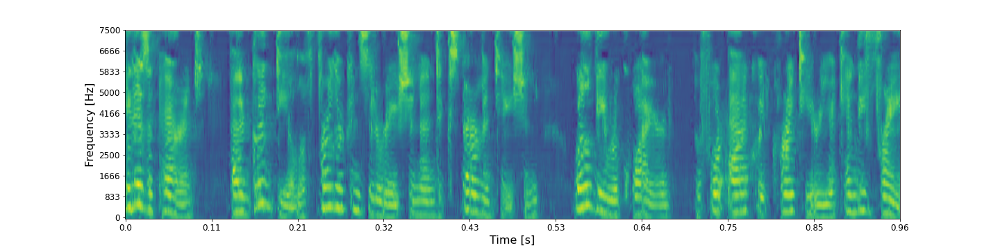

## Ground-truth

<audio controls>
<source src="audio/musan/LJ050-0099_ground_truth.wav" type="audio/mpeg">
Your browser does not support the audio element.
</audio>

**ASR**: It is apparent that a good deal of further consideration and experimentation will be required before packwood criteria can be free

## Layer 0 - shape (48 X 32 X 8)

* ### RecCNN

<audio controls>
<source src="audio/musan/LJ050-0099_layer_0_reccnn.wav" type="audio/mpeg">
Your browser does not support the audio element.
</audio>

**ASR**:  It is apparent that a good deal of further consideration and experimentation will be required before packwood criteria can be free

* ### RecGAN

<audio controls>
<source src="audio/musan/LJ050-0099_layer_0_recgan.wav" type="audio/mpeg">
Your browser does not support the audio element.
</audio>

**ASR**:  It is apparent that a good deal of further consideration and experimentation will be required before packwood criteria can be free

## Layer 1 - shape (24 X 16 X 16)

* ### RecCNN

<audio controls>
<source src="audio/musan/LJ050-0099_layer_1_reccnn.wav" type="audio/mpeg">
Your browser does not support the audio element.
</audio>

**ASR**:  As a parent that a good deal of further consideration and experimentation will be required before packwood criteria can be free

* ### RecGAN

<audio controls>
<source src="audio/musan/LJ050-0099_layer_1_recgan.wav" type="audio/mpeg">
Your browser does not support the audio element.
</audio>

**ASR**:  It is apparent that a good deal of further consideration and experimentation will be required before the quick right here you can be free

## Layer 2 - shape (12 X 8 X 32)

* ### RecCNN

<audio controls>
<source src="audio/musan/LJ050-0099_layer_2_reccnn.wav" type="audio/mpeg">
Your browser does not support the audio element.
</audio>

**ASR**:  Is it carries a good deal for their consideration and experimentation will be required for packwood criteria kenny fray

* ### RecGAN

<audio controls>
<source src="audio/musan/LJ050-0099_layer_2_recgan.wav" type="audio/mpeg">
Your browser does not support the audio element.
</audio>

**ASR**: As if parents that it deals from consideration and experimentation will be required before i quit criteria candy fray

## Layer 3 - shape (6 X 4 X 64)

* ### RecCNN

<audio controls>
<source src="audio/musan/LJ050-0099_layer_3_reccnn.wav" type="audio/mpeg">
Your browser does not support the audio element.
</audio>

**ASR**:  His parents had to deal further consideration at experimentation will be required before actually criteria can be free

* ### RecGAN

<audio controls>
<source src="audio/musan/LJ050-0099_layer_3_recgan.wav" type="audio/mpeg">
Your browser does not support the audio element.
</audio>

**ASR**:  Is it parents at he looks for the consideration and experimentation will be required before actually criteria to be free

## Layer 5 - shape (1 X 128)

* ### RecCNN

<audio controls>
<source src="audio/musan/LJ050-0099_layer_6_reccnn.wav" type="audio/mpeg">
Your browser does not support the audio element.
</audio>

**ASR**:  That for five years the fed if it is useful for his family for and received

* ### RecGAN

<audio controls>
<source src="audio/musan/LJ050-0099_layer_6_recgan.wav" type="audio/mpeg">
Your browser does not support the audio element.
</audio>

**ASR**:  In scratching her thoughts finance and the as leaves you look as his terms we already had are added tax cut and job training

