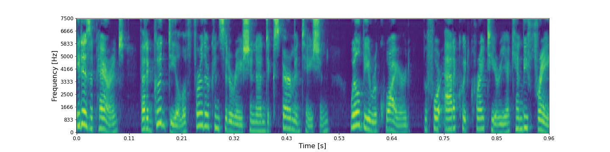
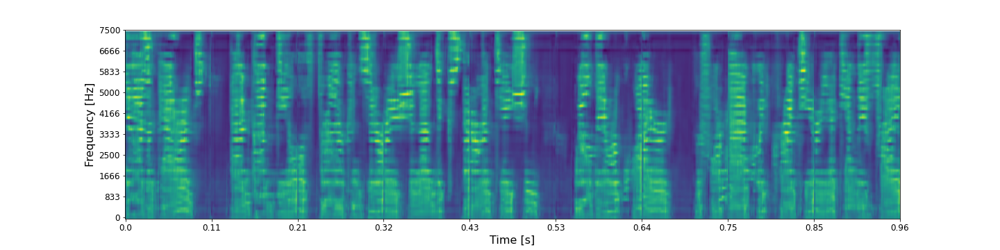
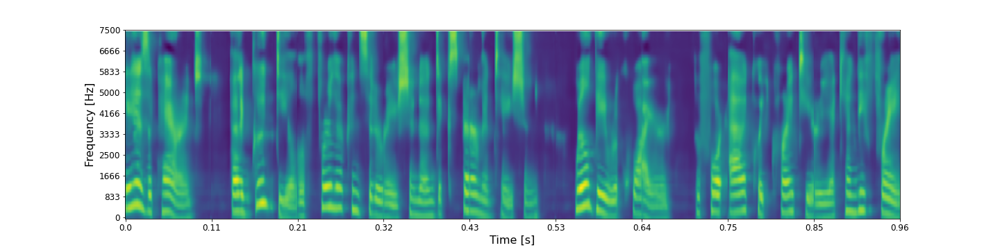
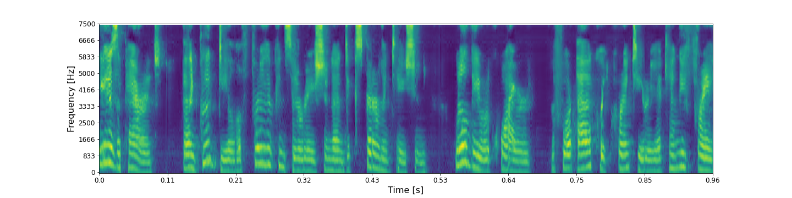
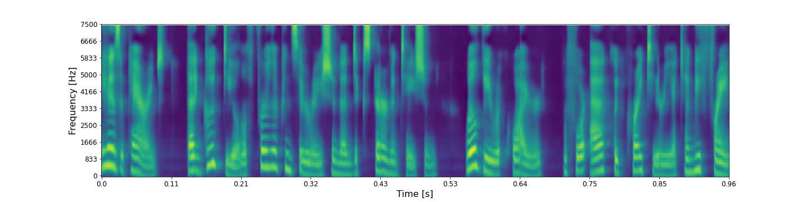
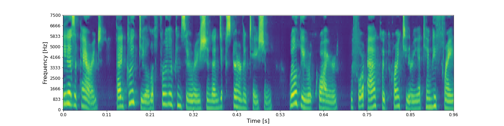
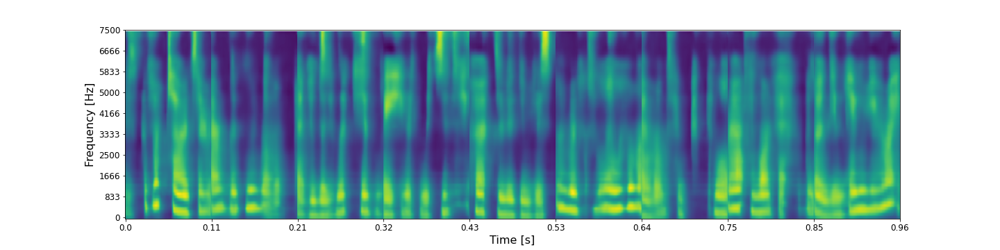
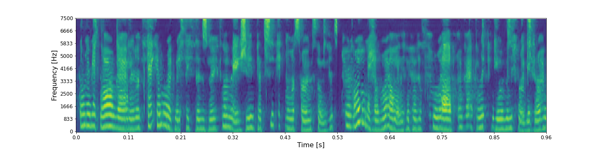

## Ground-truth

<audio controls>
<source src="audio/speech_commands_v2/LJ050-0099_ground_truth.wav" type="audio/mpeg">
Your browser does not support the audio element.
</audio>

**ASR**: It is apparent that a good deal of further consideration and experimentation will be required before packwood criteria can be free

## Layer 0 - shape (48 X 32 X 8)

* ### RecCNN

<audio controls>
<source src="audio/speech_commands_v2/LJ050-0099_layer_0_reccnn.wav" type="audio/mpeg">
Your browser does not support the audio element.
</audio>

**ASR**:  Is apparent that a good deal of further consideration and experimentation will be required before packwood criteria can be free

* ### RecGAN

<audio controls>
<source src="audio/speech_commands_v2/LJ050-0099_layer_0_recgan.wav" type="audio/mpeg">
Your browser does not support the audio element.
</audio>

**ASR**:  It is apparent that a good deal of further consideration and experimentation will be required before packwood criteria can be free

## Layer 1 - shape (24 X 16 X 16)

* ### RecCNN

<audio controls>
<source src="audio/speech_commands_v2/LJ050-0099_layer_1_reccnn.wav" type="audio/mpeg">
Your browser does not support the audio element.
</audio>

**ASR**:  Is apparent that a good deal further consideration and experimentation will be required before packwood criteria can be free

* ### RecGAN

<audio controls>
<source src="audio/speech_commands_v2/LJ050-0099_layer_1_recgan.wav" type="audio/mpeg">
Your browser does not support the audio element.
</audio>

**ASR**:  Where's the good deal of pressure consideration and experimentation we look at her acquired before tackling crank you're yanking a try

## Layer 2 - shape (12 X 8 X 32)

* ### RecCNN

<audio controls>
<source src="audio/speech_commands_v2/LJ050-0099_layer_2_reccnn.wav" type="audio/mpeg">
Your browser does not support the audio element.
</audio>

**ASR**: Is it parents that a good deal further consideration and experimentation will be required before acrid criteria can be free

* ### RecGAN

<audio controls>
<source src="audio/speech_commands_v2/LJ050-0099_layer_2_recgan.wav" type="audio/mpeg">
Your browser does not support the audio element.
</audio>

**ASR**:  Is that parents a good deal further consideration and experimentation will be required before tackling criteria can be free

## Layer 3 - shape (6 X 4 X 64)

* ### RecCNN

<audio controls>
<source src="audio/speech_commands_v2/LJ050-0099_layer_3_reccnn.wav" type="audio/mpeg">
Your browser does not support the audio element.
</audio>

**ASR**:  Is it parents and deal for the consideration and experimentation will be required for active criteria kenny fray

* ### RecGAN

<audio controls>
<source src="audio/speech_commands_v2/LJ050-0099_layer_3_recgan.wav" type="audio/mpeg">
Your browser does not support the audio element.
</audio>

**ASR**:  As a parent i tried to withdraw into consideration and experimentation will be required for at criteria twenty three

## Layer 5 - shape (1 X 128)

* ### RecCNN

<audio controls>
<source src="audio/speech_commands_v2/LJ050-0099_layer_6_reccnn.wav" type="audio/mpeg">
Your browser does not support the audio element.
</audio>

**ASR**:  Stuff outside center and its they hit as activities of full half and new i

* ### RecGAN

<audio controls>
<source src="audio/speech_commands_v2/LJ050-0099_layer_6_recgan.wav" type="audio/mpeg">
Your browser does not support the audio element.
</audio>

**ASR**:  Her get on that account right nice because they can reach a taxi to the muslims and it's a combination lock on who has rapidly to return

