## Ground-truth

<audio controls>
<source src="audio/vggish/LJ050-0099_ground_truth.wav" type="audio/mpeg">
Your browser does not support the audio element.
</audio>

**ASR**: It is apparent that a good deal of further consideration and experimentation will be required before packwood criteria can be free

## Layer 0 - shape (48 X 32 X 64)

* ### RecCNN
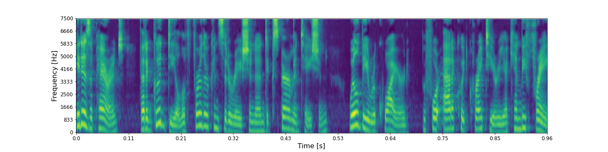

<audio controls>
<source src="audio/vggish/LJ050-0099_pool1_reccnn.wav" type="audio/mpeg">
Your browser does not support the audio element.
</audio>

**ASR**: It is apparent that a good deal of further consideration and experimentation will be required before packwood criteria can be free

* ### RecGAN
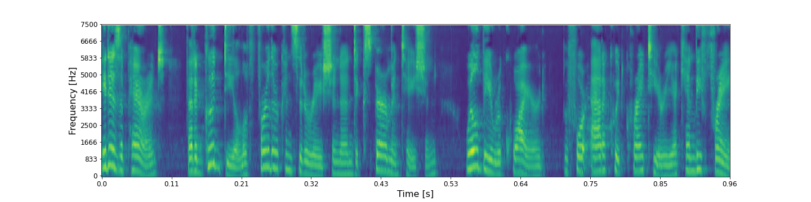

<audio controls>
<source src="audio/vggish/LJ050-0099_pool1_recgan.wav" type="audio/mpeg">
Your browser does not support the audio element.
</audio>

**ASR**: It is apparent that a good deal of further consideration and experimentation will be required for packwood criteria can be free

## Layer 1 - shape (24 X 16 X 128)

* ### RecCNN
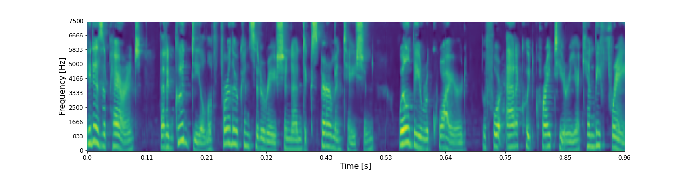

<audio controls>
<source src="audio/vggish/LJ050-0099_pool2_reccnn.wav" type="audio/mpeg">
Your browser does not support the audio element.
</audio>

**ASR**: It is apparent that a good deal of further consideration and experimentation will be required before i could criteria can be free

* ### RecGAN
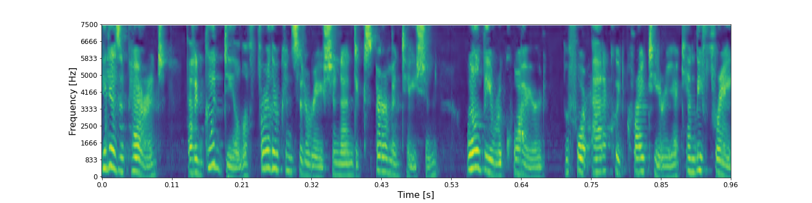

<audio controls>
<source src="audio/vggish/LJ050-0099_pool2_recgan.wav" type="audio/mpeg">
Your browser does not support the audio element.
</audio>

**ASR**: It is apparent that a good deal of further consideration and experimentation will be required before i could criteria can be free

## Layer 2 - shape (12 X 8 X 256)

* ### RecCNN
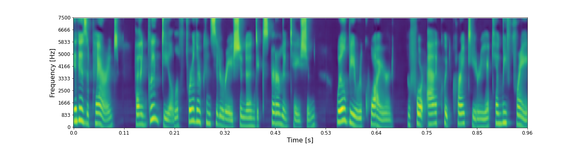

<audio controls>
<source src="audio/vggish/LJ050-0099_pool3_reccnn.wav" type="audio/mpeg">
Your browser does not support the audio element.
</audio>

**ASR**: It is apparent that a good deal of further consideration and experimentation will be required before i could criteria can be free

* ### RecGAN
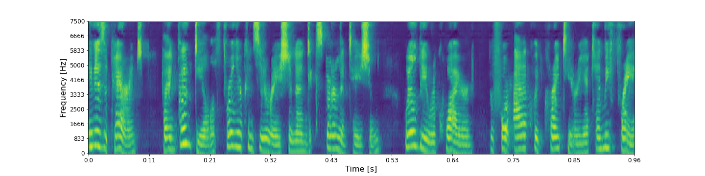

<audio controls>
<source src="audio/vggish/LJ050-0099_pool3_recgan.wav" type="audio/mpeg">
Your browser does not support the audio element.
</audio>

**ASR**: It is a clarence franklin deal trainer consideration and experimentation will be required before i could criteria can be free

## Layer 3 - shape (6 X 4 X 512)

* ### RecCNN
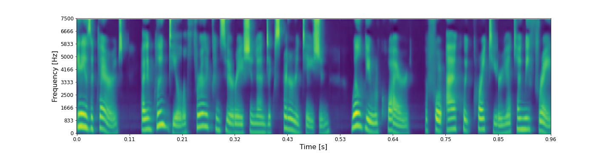

<audio controls>
<source src="audio/vggish/LJ050-0099_pool4_reccnn.wav" type="audio/mpeg">
Your browser does not support the audio element.
</audio>

**ASR**: Is it tears and good deal for any consideration and experimentation will be required for aqua criteria kenny fray

* ### RecGAN
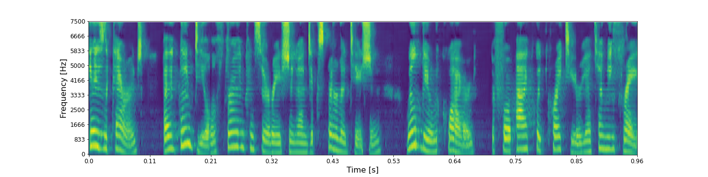

<audio controls>
<source src="audio/vggish/LJ050-0099_pool4_recgan.wav" type="audio/mpeg">
Your browser does not support the audio element.
</audio>

**ASR**: Is that parents have a good deal of time consideration and experimentation will be required for packwood criteria twenty three

## Layer 4 - shape (1 X 4096)

* ### RecCNN
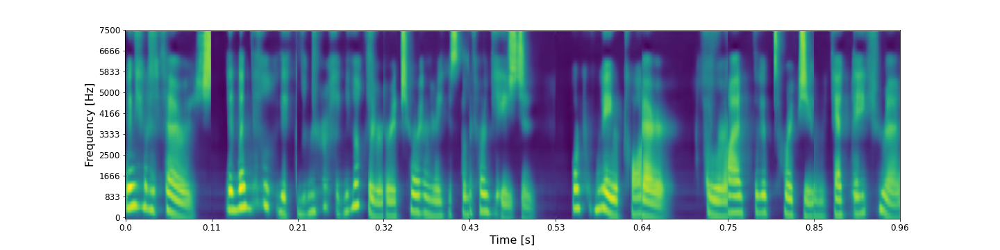

<audio controls>
<source src="audio/vggish/LJ050-0099_fc1_1_reccnn.wav" type="audio/mpeg">
Your browser does not support the audio element.
</audio>

**ASR**: If there's an anvil it not sir each for her it's a different vision or nato air power i it's purging and a trap

* ### RecGAN
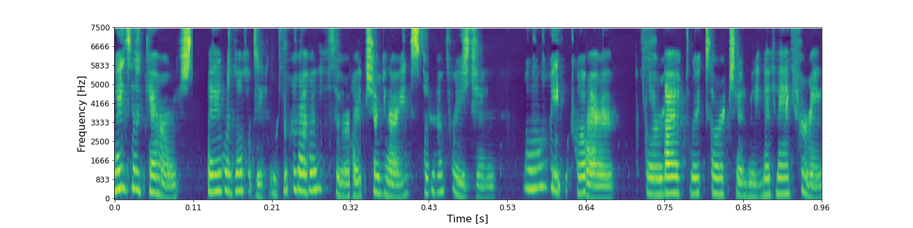

<audio controls>
<source src="audio/vggish/LJ050-0099_fc1_1_recgan.wav" type="audio/mpeg">
Your browser does not support the audio element.
</audio>

**ASR**: As npr's a little puts it eleventh circuit judge her instead of christian will be a rare color actually starting in the country

## Layer 5 - shape (1 X 4096)

* ### RecCNN
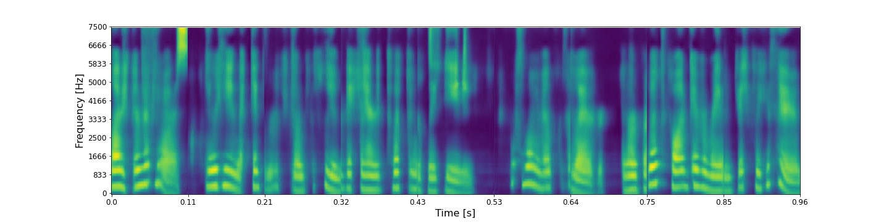

<audio controls>
<source src="audio/vggish/LJ050-0099_fc1_2__reccnn.wav" type="audio/mpeg">
Your browser does not support the audio element.
</audio>

**ASR**: I have asked you to cater for the mechanic for the easy for her at five in the rain is to say

* ### RecGAN
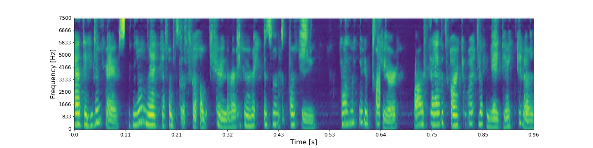

<audio controls>
<source src="audio/vggish/LJ050-0099_fc1_2_recgan.wav" type="audio/mpeg">
Your browser does not support the audio element.
</audio>

**ASR**: Encampments along and customs of culture to peasants' party want to try your heart that's part of a kick out

## Layer 6 - shape (1 X 128)

* ### RecCNN
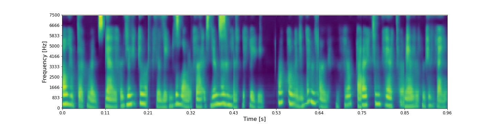

<audio controls>
<source src="audio/vggish/LJ050-0099_fc2_reccnn.wav" type="audio/mpeg">
Your browser does not support the audio element.
</audio>

**ASR**: For a stand is a perfidy live says he never had sent it to the g. n.

* ### RecGAN
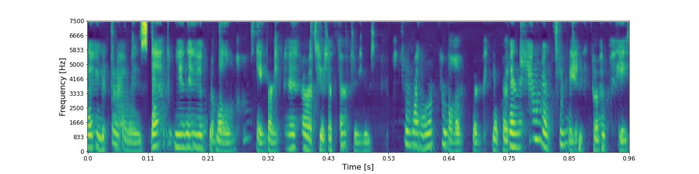

<audio controls>
<source src="audio/vggish/LJ050-0099_fc2_recgan.wav" type="audio/mpeg">
Your browser does not support the audio element.
</audio>

**ASR**: And it's surroundings at a unit of all the cars and carriages for genes from our palm or get over it and how answered a certainty
