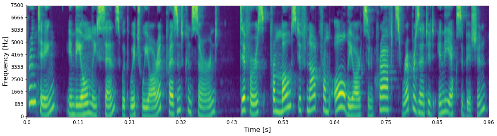

## Ground-truth

<audio controls>
<source src="audio/LJ049-0209.wav" type="audio/mpeg">
Your browser does not support the audio element.
</audio>

**ASR**: commission was not asked to apply itself as did the closure commission in nineteen four

## Layer 0 - shape (48 X 32 X 64)

* ### RecCNN
* ### RecGAN

## Layer 1 - shape (24 X 16 X 128)

* ### RecCNN
* ### RecGAN

## Layer 2 - shape (12 X 8 X 256)

* ### RecCNN
* ### RecGAN

## Layer 3 - shape (6 X 4 X 512)

* ### RecCNN
* ### RecGAN

## Layer 4 - shape (1 X 4096)

* ### RecCNN
* ### RecGAN

## Layer 5 - shape (1 X 4096)

* ### RecCNN
* ### RecGAN

## Layer 6 - shape (1 X 128)

* ### RecCNN
* ### RecGAN
